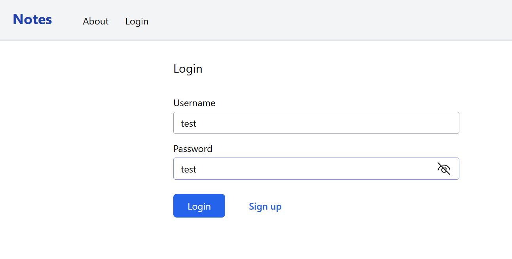

## Notes App

- Simple note-taking app. Users can sign up and login into the app. Authorization implemented using JWT

- Users can add, edit, update, delete and search their notes

- Authorization implemented using JWT with refresh token

- Users can add, edit, update, delete and search their notes

- Technologies and libraries:
  - Backend: ASP.NET Core Web API v7, SqlKata, Dapper, Autofac, AutoMapper
  - Frontend: Angular v16 standalone component, Tailwind CSS
  - Database: Sqlite for simplicity

#### Screenshots

Login page

Notes home page

